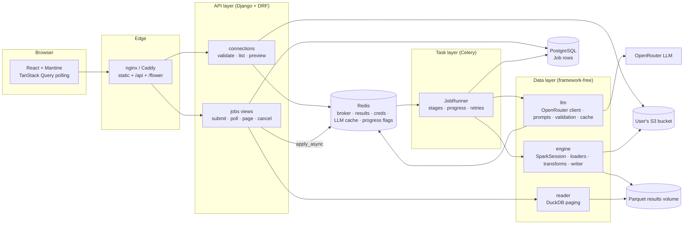

# NL Regex Platform

Connect to **your own S3 bucket**, pick a CSV or Excel file, describe a pattern in plain
English, and let an LLM-generated regular expression run **asynchronously on PySpark**
across the target columns — with live progress, paginated results and a validated,
ReDoS-safe pattern.

> **Live demo:** https://nlregex-jimmy.duckdns.org — connect with your own AWS Access Key / Secret Key / bucket.
>
> **Demo video** (2.5 min): connecting to S3 with user-entered credentials, an async job running to completion, LLM cache hit, Normalize/Extract transforms, and Flower.

https://github.com/user-attachments/assets/f988ffe8-b38a-4ceb-b41b-a9e86edc418f

| Stack | Django 5 · DRF · Celery 5 · Redis 7 · PostgreSQL 16 · PySpark 3.5 (Hadoop 3.3 / s3a) · DuckDB · React 18 · Vite · Mantine · nginx · Caddy · Flower |
|---|---|

---

## Contents

1. [Quick start](#1-quick-start)
2. [How it works](#2-how-it-works)
3. [Architecture](#3-architecture)
4. [Partitioning, parallelism and why it scales](#4-partitioning-parallelism-and-why-it-scales)
5. [LLM integration and regex safety](#5-llm-integration-and-regex-safety)
6. [Security: handling user credentials](#6-security-handling-user-credentials)
7. [Asynchronous processing: progress, retries, cancellation](#7-asynchronous-processing-progress-retries-cancellation)
8. [API reference](#8-api-reference)
9. [Observability](#9-observability)
10. [Tests](#10-tests)
11. [Load test](#11-load-test)
12. [Deployment](#12-deployment)
13. [Trade-offs and notes](#13-trade-offs-and-notes)

---

## 1. Quick start

Prerequisites: Docker Desktop (or Docker Engine + Compose v2). Nothing else — Python, Java,
Spark and Node all live inside the containers.

```bash
git clone https://github.com/alkaid040492/nl-regex-platform.git && cd nl-regex-platform
cp .env.example .env
# edit .env: set OPENROUTER_API_KEY (or LLM_PROVIDER=fake to try it without a key),
#            generate FERNET_KEY and DJANGO_SECRET_KEY (commands are in the file)
docker compose up --build
```

Then open **http://localhost**.

The development override (`docker-compose.override.yml`, auto-loaded) also starts a local
S3-compatible server (Adobe S3Mock) seeded with `scripts/sample_data/sample.csv`, so you can
try the app without an AWS account:

| Field | Value |
|---|---|
| Access Key | `test` (anything works) |
| Secret Key | `test` (anything works) |
| Bucket | `demo` |

Against **real AWS**, enter your IAM user's keys and bucket. The IAM user needs
`s3:ListBucket` on the bucket and `s3:GetObject` on its objects; nothing else.

Useful URLs while developing:

| URL | What |
|---|---|
| http://localhost | React UI (nginx) |
| http://localhost/api/health/ | DB / Redis / worker health |
| http://localhost/flower/ | Celery monitoring (Flower) |
| http://localhost:8000/api/… | Django dev server directly |
| http://localhost:9090 | S3Mock |

---

## 2. How it works

1. **Connect** — the user enters Access Key, Secret Key and bucket. The API detects the
   bucket's region (`HeadBucket` → `x-amz-bucket-region`, so users never have to know it),
   validates access (`ListObjectsV2` with `MaxKeys=1`), encrypts the credentials with Fernet and stores them
   in Redis under a random `connection_id` with a 2-hour TTL. The response carries only the
   id and the last 4 characters of the key.
2. **Pick a file** — the API lists `.csv/.xlsx/.xls` objects and, for the chosen one, reads
   the first ~2 MB with a ranged GET to show columns and a 5-row preview (no Spark involved).
3. **Describe** — the user picks target column(s), a transform type and types a sentence
   such as *"Find email addresses in the Email column and replace them with REDACTED"*.
4. **Submit** — `POST /api/jobs/` writes a `Job` row (`QUEUED`) and dispatches a Celery
   task **after the transaction commits**, returning `202 {job_id}` in a few milliseconds.
5. **Run (Celery worker)** —
   `LOAD` (Spark reads the file straight from S3 via `s3a://`) →
   `LLM` (Redis cache → OpenRouter) →
   `VALIDATE` (Python compile, dialect translation, ReDoS static + timed checks, JVM compile) →
   `TRANSFORM` (Catalyst-native `regexp_replace` / `regexp_extract`) →
   `WRITE` (Parquet on a shared volume). Progress is written to the row throughout.
6. **View** — the UI polls `GET /api/jobs/{id}/` every 1.5 s, then pages through
   `GET /api/jobs/{id}/result/?page=N` which DuckDB serves from Parquet in milliseconds.

### Example (from the assessment brief)

| ID | Name | Email |
|---|---|---|
| 1 | John Doe | john.doe@example.com |
| 2 | Jane Smith | jane_smith@domain.com |

Prompt: *"Find email addresses in the Email column and replace them with 'REDACTED'."*
Generated pattern: `\b[A-Za-z0-9._%+-]+@[A-Za-z0-9.-]+\.[A-Za-z]{2,7}\b` → every Email cell
becomes `REDACTED`, `matched_rows = 2`.

### Three LLM-powered transformations

| Type | What the LLM produces | Spark operation |
|---|---|---|
| **REPLACE** | a pattern | `regexp_replace(col, pattern, literal)` — the user's replacement is escaped so `$` and `\` are literal |
| **EXTRACT** | a pattern + capture-group index | `regexp_extract(col, pattern, group)` into a new column |
| **NORMALIZE** | a pattern **and** a `$1`/`$2` replacement template | `regexp_replace(col, pattern, template)` — e.g. `2024/01/05` → `05-01-2024` |

All three share one task, one validation path and one Spark pipeline; only the column
expression differs (`apps/engine/transforms.py`).

---

## 3. Architecture



### Code layout

```
backend/
  config/            settings, urls, celery app (+ Spark warm-up on worker_ready)
  apps/
    core/            AppError + DRF handler, Fernet crypto, Redis client, secret-masking log filter, health/metrics
    connections/     API layer for S3: S3Service (boto3 + error translation), encrypted credential store
    jobs/            API layer (views/serializers) + task layer (tasks.py → runner.py, progress.py, cancellation.py) + Job model
    llm/             OpenRouter client, prompts (few-shot per transform), Redis cache, three-layer regex validation
    engine/          PySpark data layer: session (per-bucket s3a creds), loaders, transforms, writer, DuckDB reader
  tests/             pytest: transforms, validation, reader, connections API, end-to-end task
frontend/src/
  api/               typed fetch client + endpoints
  features/          connect · files · job (form, progress) · results (paged table)
```

Design rules that keep the layers honest:

* **`apps/engine` and `apps/llm/validation.py` never import Django.** They take plain
  arguments (`SparkConfig`, strings, DataFrames) and can be unit-tested without the web
  stack. The task layer adapts settings/models to them.
* **Views are thin.** Validate input with a serializer, call one service, shape the response.
  Every error is an `AppError` subclass rendered as `{"code", "message"}`; the frontend
  branches on `code`.
* **The Job row is the only source of truth for status.** The worker updates it; the API
  reads it. Redis holds only ephemeral things (credentials, cache, cancel flags, heartbeat).

---

## 4. Partitioning, parallelism and why it scales

**No Python in the hot path.** The transformation is built from Catalyst-native functions
(`regexp_replace`, `regexp_extract`, `rlike`, `coalesce`). Spark compiles the expression to
JVM bytecode and executes it per partition; there are no Python UDFs, no `collect()`, no
row iteration. Throughput therefore scales with cores × partitions rather than with the
Python interpreter, and adding executors (or switching `SPARK_MASTER` to a cluster URL)
requires no code change.

**Reading from S3 is already distributed.** CSV files are read through the `s3a`
connector with `spark.sql.files.maxPartitionBytes = 32m` (default 128m), so a 180 MB file
becomes ~6 partitions and a 2 GB file ~64 — enough tasks to keep every core busy on a
single node while avoiding thousands of tiny tasks. Spark splits CSV by byte ranges, so no
node ever has to hold the whole file.

**One pass over the data.** The `_matched` boolean column is computed in the same
projection as the replacement, and the Parquet write is the only Spark action. Row count
and matched-row count are then read from the Parquet footer/row groups by DuckDB, instead of
a second Spark `count()`.

**Paging does not touch Spark.** Results are written as snappy Parquet with a stable
`_row_id` (`monotonically_increasing_id`). The web process pages with DuckDB
(`… ORDER BY _row_id LIMIT ? OFFSET ?`), which reads only the needed row groups/columns.
A page of 50 rows out of 2 M returns in tens of milliseconds and the browser never sees
more than one page.

**Progress from Spark itself.** During the write, a monitor thread polls
`SparkContext.statusTracker()` and maps completed/total tasks of the active stages onto the
30–90 % range of the progress bar, so progress reflects real work rather than a timer.

**Resource model.** Spark runs in `local[*]` inside the Celery worker container; the
worker uses `--pool=solo --concurrency=1` because one process should own one JVM driver.
Horizontal scaling = more worker containers (each with its own SparkSession) pulling from
the same Redis queue; vertical scaling = `SPARK_DRIVER_MEMORY`. `spark.sql.adaptive.enabled`
coalesces small shuffle partitions automatically (there are no shuffles in the main path,
but Excel ingestion repartitions to `defaultParallelism`).

**Excel** has no Spark reader and is capped by the format at ~1 M rows per sheet, so it is
downloaded once, parsed with pandas/openpyxl and handed to `spark.createDataFrame` with an
explicit `repartition(cores)`. Everything after that is identical to the CSV path.

---

## 5. LLM integration and regex safety

* **Provider:** OpenRouter (OpenAI-compatible) via the `openai` SDK with `base_url`;
  the model is configurable (`OPENROUTER_MODEL`, default `anthropic/claude-sonnet-4.5`).
  `LLM_PROVIDER=fake` swaps in a deterministic stub for local development and CI.
* **Prompting:** one system prompt per transform type with few-shot examples of the
  phrasings people actually type (emails, phones, dates, URLs, card numbers), an explicit
  instruction to emit **Java `java.util.regex` syntax** (Spark runs on the JVM), to avoid
  nested unbounded quantifiers, and to answer as a single JSON object
  (`response_format: json_object`, `temperature 0`). The user's sentence, the target
  column names and up to 6 sample values per column are sent as context. A malformed reply
  is retried once with a repair instruction.
* **Caching:** `sha256(transform_type | normalized prompt)` → RegexSpec JSON in Redis for
  7 days. Sample values are intentionally excluded from the key so the same intent on a
  different file is still a hit. Hit/miss counters are exposed at `/api/metrics/summary/`.
  A cached pattern that later fails validation is evicted, so a bad answer cannot poison
  future runs.
* **Validation (`apps/llm/validation.py`)** runs before anything touches the data:
  1. **Dialect & syntax** — Python-only constructs are translated (`(?P<n>` → `(?<n>`,
     `(?P=n)` → `\k<n>`) or rejected (`\A`, `\Z`, `(?#…)`), then the pattern is compiled.
  2. **Static ReDoS check** — the regex parse tree is walked and any *nested unbounded
     repetition* (`(a+)+`, `(.*)*`, `(\w+\s?)*`, `((ab)*)+`) is rejected.
  3. **Timed execution** — the pattern is run with the `regex` module's `timeout=1s`
     against the sample values and a set of adversarial strings (long runs of `a`, `ab`,
     digits, spaces followed by a non-match). Anything slow is rejected.
  4. **JVM compile** — the worker compiles the final pattern with
     `java.util.regex.Pattern.compile` through py4j, so the exact engine that will run it
     has accepted it.
  NORMALIZE templates are additionally checked so `$n` only references groups that exist,
  and literal `$`/`\` are escaped.

---

## 6. Security: handling user credentials

The brief asks that credentials are never logged, returned, or stored in plain text.

| Concern | Implementation |
|---|---|
| Storage | Fernet-encrypted (`FERNET_KEY` from the environment) in Redis with a 2 h TTL, extended on use. Never written to PostgreSQL. `Job` rows store only the `connection_id`. |
| Transport | Production runs behind Caddy with automatic HTTPS (Let's Encrypt). |
| API responses | The serializer marks `secret_key` `write_only`; responses include only `access_key_hint` (`****ABCD`). |
| Logs | `SecretMaskingFilter` on every handler masks `AKIA…` ids, 40-char secret-shaped strings, `secret_key=…` pairs and OpenRouter keys. `S3Credentials.__repr__` never shows the secret, so tracebacks are safe. |
| Spark | Credentials are attached per bucket (`fs.s3a.bucket.<name>.access.key`) and removed after the job; `fs.s3a.impl.disable.cache=true` prevents Hadoop from caching a FileSystem bound to another user's keys. |
| Least privilege | Only `HeadBucket`, `ListObjectsV2`, `HeadObject`, `GetObject` are ever called. |
| Errors | Invalid key / wrong bucket / no permission / unreachable endpoint each map to a distinct code (`INVALID_CREDENTIALS`, `BUCKET_NOT_FOUND`, `ACCESS_DENIED`, `NETWORK_ERROR`) with a plain-language message. |

---

## 7. Asynchronous processing: progress, retries, cancellation

* **Submit returns immediately.** The task is dispatched with `transaction.on_commit`, so
  the worker can never see a job id that does not exist yet.
* **Status model:** `QUEUED → RUNNING → SUCCESS | FAILED | CANCELLED`, plus `stage`
  (`LOAD/LLM/VALIDATE/TRANSFORM/WRITE/DONE`), `progress 0–100`, `error_code`,
  `error_message`, `started_at/finished_at`.
* **Retries:** transient failures (LLM rate-limit/timeouts, S3 throttling/network) are
  retried up to 3 times with 10/30/60 s back-off; the job goes back to `QUEUED` with a
  visible *"retrying in 30 s (attempt 2/3)"* message. Permanent failures (invalid regex,
  missing column, expired connection) fail fast with a specific code.
* **Time limits:** Celery `soft_time_limit=1800 s`; on expiry the Spark job group is
  cancelled and the job is marked `FAILED / TIMEOUT`.
* **Cancellation:** the worker runs a solo pool (one JVM per process), where
  `revoke(terminate=True)` is unavailable. Instead `POST /jobs/{id}/cancel/` sets a Redis
  flag: a queued job is marked `CANCELLED` immediately; a running job checks the flag
  between stages, and during the Spark stage the monitor thread calls
  `cancelJobGroup(job_id)`, which aborts running tasks within seconds. Partial output is
  deleted.
* **Idempotent output:** results are written with `mode("overwrite")` to
  `/data/results/<job_id>/`, so a retried task cannot leave mixed partial files.
* **Worker liveness:** a solo worker cannot answer `celery inspect ping` while a job runs,
  so `/api/health/` falls back to a Redis heartbeat written with every progress update.

---

## 8. API reference

All responses are JSON. Errors: `{"code": "...", "message": "...", "details"?: {...}}`.

| Method | Path | Purpose | Success |
|---|---|---|---|
| `POST` | `/api/connections/` | Validate & store credentials. Body `{access_key, secret_key, bucket, region?}` | `201 {connection_id, bucket, region, access_key_hint, expires_at}` |
| `GET` | `/api/connections/{id}/` | Connection info | `200` |
| `DELETE` | `/api/connections/{id}/` | Forget credentials now | `204` |
| `GET` | `/api/connections/{id}/files/?prefix=` | List CSV/Excel objects | `200 {bucket, files:[{key,size,last_modified,kind}]}` |
| `GET` | `/api/connections/{id}/files/schema/?key=` | Columns + 5 sample rows from the file head | `200 {columns:[{name,dtype}], sample_rows, sampled_rows}` |
| `POST` | `/api/jobs/` | Submit. Body `{connection_id, file_key, transform_type, prompt, replacement?, columns[], new_column_name?}` | `202 {job_id, status}` |
| `GET` | `/api/jobs/` | Last 50 jobs | `200 [...]` |
| `GET` | `/api/jobs/{id}/` | Poll status/progress/pattern/counts | `200 {status, stage, progress, regex_pattern, row_count, matched_rows, error_code, ...}` |
| `POST` | `/api/jobs/{id}/cancel/` | Cooperative cancel | `200 job` (`409` if already finished) |
| `GET` | `/api/jobs/{id}/result/?page=1&page_size=50&only_matched=false` | Page of processed rows | `200 {columns, rows, page, page_size, total_rows, total_pages, matched_rows}` (`409` until SUCCESS) |
| `GET` | `/api/health/` | `{db, redis, worker}` | `200` / `503` |
| `GET` | `/api/metrics/summary/` | Jobs by status, avg duration, LLM cache hits/misses | `200` |

Error codes you will see: `VALIDATION_ERROR`, `INVALID_CREDENTIALS`, `ACCESS_DENIED`,
`BUCKET_NOT_FOUND`, `NETWORK_ERROR`, `CONNECTION_EXPIRED`, `UNSUPPORTED_FILE`,
`INVALID_REGEX`, `UNSAFE_REGEX`, `INVALID_COLUMNS`, `LLM_ERROR`, `LLM_UNAVAILABLE`,
`LLM_NOT_CONFIGURED`, `TIMEOUT`, `CONFLICT`, `NOT_FOUND`, `INTERNAL_ERROR`.

---

## 9. Observability

* **Flower** at `/flower/` — task list, runtimes, worker state (task events enabled).
* **`/api/metrics/summary/`** — job counts per status, average duration of successful
  jobs, LLM cache hit/miss counters.
* **`/api/health/`** — DB, Redis and worker (ping or heartbeat) status; used by the UI
  header badge and by the compose healthcheck.
* **Structured JSON logs** (`python-json-logger`) in production, with secrets masked.
  Every job logs its pattern, row counts and outcome with the job id.

---

## 10. Tests

```bash
docker compose exec web pytest -q
```

59 tests, ~35 s (a local SparkSession is started once per session):

| File | Covers |
|---|---|
| `test_transforms.py` | REPLACE / EXTRACT / NORMALIZE semantics, `_matched` flags, literal escaping of `$`/`\`, multi-column behaviour, error cases |
| `test_validation.py` | good patterns pass; `(a+)+`-style patterns rejected; invalid syntax; Python→Java dialect translation; template `$n` checks |
| `test_reader.py` | DuckDB stats, deterministic paging across Parquet files, `only_matched` |
| `test_connections_api.py` | encrypted store round-trip and TTL, connect/list/schema/delete against moto S3, every boto error → code mapping, log masking |
| `test_tasks.py` | JobRunner end-to-end (moto S3 → fake LLM → Spark → Parquet → API paging), cache hit on second run, unsafe regex fails the job and evicts the cache, JVM-only rejection, missing column, expired connection, cancel-before-start, eager submit through the API |

The LLM is replaced by `FakeLLM`; S3 by `moto`; Redis is the real one (db 15).

---

## 11. Load test

Synthetic file from `scripts/generate_large_csv.py`: **2,000,000 rows, 6 columns, 147 MB CSV**,
70 % of rows with an email in `Email` and ~30 % with a second one in `Notes`.
Job: REPLACE, prompt *"Find email addresses and replace them with REDACTED"*, columns `Email, Notes`.

Development machine (Docker Desktop, 16 vCPU / 15 GB), Spark `local[*]`, driver 2 g:

| Metric | Result |
|---|---|
| Submit → `202` | < 50 ms |
| Whole job (`started_at` → `finished_at`) | **13.5 s** |
| of which Spark read + regexp_replace + Parquet write | ~5 s |
| Rows / rows containing a match | 2,000,000 / 1,486,041 |
| Peak worker RSS (JVM + Python) | 1.65 GB |
| `GET …/result/?page=1` | 47 ms |
| `GET …/result/?page=40000` (row 2,000,000) | 620 ms |
| `GET …/result/?only_matched=true&page=500` | 61 ms |

Paging never touches Spark; the browser receives at most `page_size` rows (max 500). On the
4 vCPU public demo VM the same job takes roughly 3–4× longer, still well under a minute.

Reproduce:

```bash
python scripts/generate_large_csv.py --rows 2000000 --out scripts/out/large.csv
# upload to the dev S3Mock (or to your real bucket with the AWS CLI)
docker compose run --rm -v "$PWD/scripts/out:/sample:ro" s3-seed
# then submit "Find email addresses and replace them with REDACTED" on columns Email, Notes
```

---

## 12. Deployment

The public demo runs on a single 8 GB / 4 vCPU Ubuntu VM with Docker:

```bash
# on the server (root, Ubuntu 24.04):
curl -fsSL https://raw.githubusercontent.com/alkaid040492/nl-regex-platform/main/scripts/server_setup.sh | bash
# from your machine: copy a filled-in .env (OPENROUTER_API_KEY, FERNET_KEY, DJANGO_SECRET_KEY,
#                    DJANGO_ALLOWED_HOSTS=<domain>, DOMAIN=<domain>, DJANGO_DEBUG=0)
scp .env root@<server>:/opt/nl-regex-platform/.env
# on the server:
/opt/nl-regex-platform/scripts/deploy.sh      # re-run any time to pull + rebuild + restart
```

`scripts/server_setup.sh` installs Docker if needed, adds swap, opens ports 22/80/443 and
clones the repo; `scripts/deploy.sh` validates `.env`, runs
`docker compose -f docker-compose.yml -f docker-compose.prod.yml up -d --build` and waits
for the health check.

`docker-compose.prod.yml` adds **Caddy**, which obtains a Let's Encrypt certificate for
`$DOMAIN` and proxies to the nginx frontend; the dev-only S3Mock and exposed ports are not
included. Point a DNS A record (a free DuckDNS name works) at the VM before starting.

Sizing: `SPARK_DRIVER_MEMORY=3g` leaves room for Postgres, Redis, Django and Flower on
8 GB. For larger files raise it or add worker replicas (`docker compose up -d --scale worker=2`).

---

## 13. Trade-offs and notes

* **Single-node Spark (`local[*]`).** The brief asks for a PySpark engine that scales
  across partitions; the code is cluster-ready (`SPARK_MASTER`, s3a, no driver-side
  collection) but the demo runs one node to keep the stack a single `docker compose up`.
* **Excel via pandas.** Spark has no built-in Excel reader; the community `spark-excel`
  jar drags in Scala-version alignment issues. Excel is size-capped by the format anyway,
  so pandas → `createDataFrame` is pragmatic and documented.
* **All columns as strings.** Files are loaded with `inferSchema=false` so untouched
  columns come back exactly as they were in the source and regex operations are always
  string operations. The UI shows a cheap type hint for column selection.
* **Progress granularity.** Spark does not expose per-row progress; stage-based progress
  plus task-completion ratios from `statusTracker` is the accurate, low-overhead option.
* **Cancellation is cooperative** (flag + `cancelJobGroup`), not a process kill, because
  killing the worker would take the JVM down with it.
* **Result retention.** Parquet results live on a volume; a cleanup command
  (`python manage.py clean_results --older-than 7`) can be run from cron.
* **Dev S3 mock quirk.** Java-based S3 mocks close the connection on botocore's
  `Expect: 100-continue` uploads, so the dev seed command strips that header. Real S3 is
  unaffected, and the application itself never uploads.
* **Not in scope:** authentication/multi-tenancy (the brief frames a single-user tool;
  connection ids are unguessable UUIDs with a TTL), writing results back to S3 (an easy
  extension of `writer.py`).
